# LearnHub - Progressive Web Application (PWA)

A modern, full-stack learning management platform built with Next.js that provides an immersive course learning experience with video integration, progress tracking, and PWA capabilities for native app-like functionality.

## 📋 Description

LearnHub is a comprehensive learning platform that enables users to browse courses by category, watch embedded video lessons, track their learning progress, and install the app on their devices for offline access. The application features secure user authentication, real-time progress tracking, and a responsive design optimized for both desktop and mobile devices.

## 🌐 Live Demo

**Live Application:** [https://learning-hub-dusky.vercel.app/](https://learning-hub-dusky.vercel.app/)

### Test Credentials

You can use the following credentials to test the application:

- **Email:** `test@email.com`
- **Password:** `123456`

## 📸 Screenshots

### Desktop View
<div align="center">
  <table>
    <tr>
      <td align="center">
        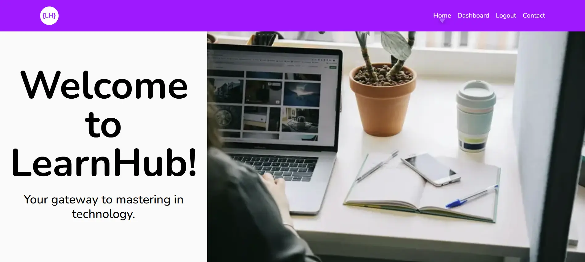
        <br/><strong>Home Page</strong>
      </td>
      <td align="center">
        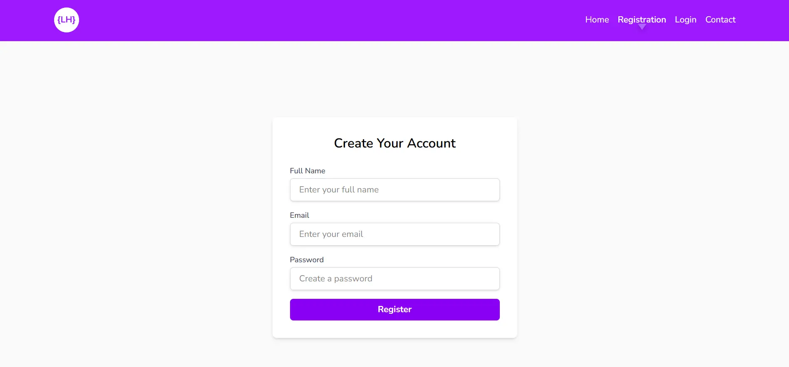
        <br/><strong>Registration</strong>
      </td>
    </tr>
    <tr>
      <td align="center">
        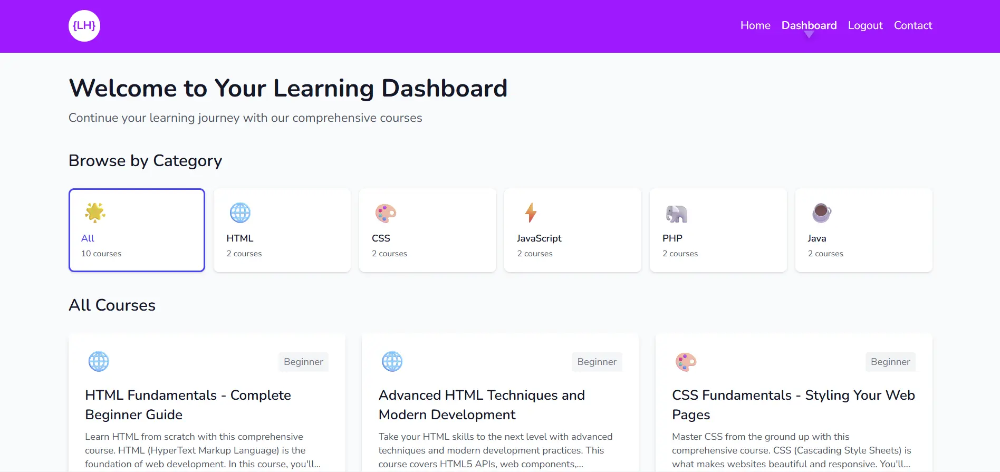
        <br/><strong>Dashboard</strong>
      </td>
      <td align="center">
        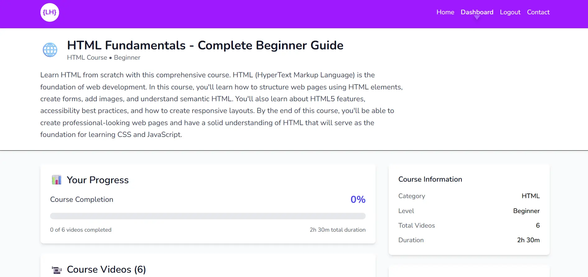
        <br/><strong>Course View</strong>
      </td>
    </tr>
    <tr>
      <td align="center">
        
        <br/><strong>Course Details</strong>
      </td>
      <td align="center">
        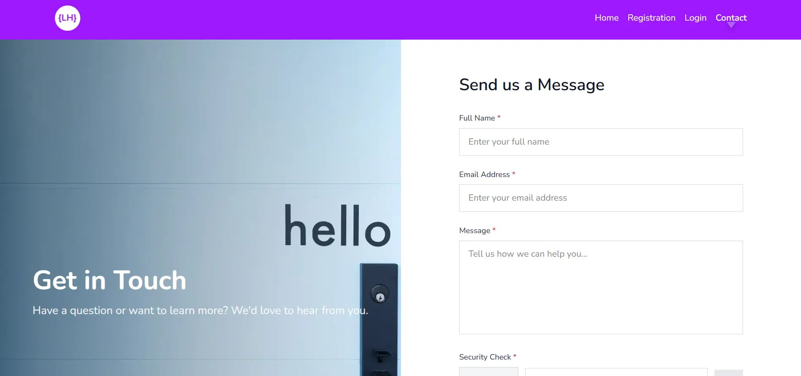
        <br/><strong>Contact</strong>
      </td>
    </tr>
  </table>
</div>

### Tablet View
<div align="center">
  <table>
    <tr>
      <td align="center">
        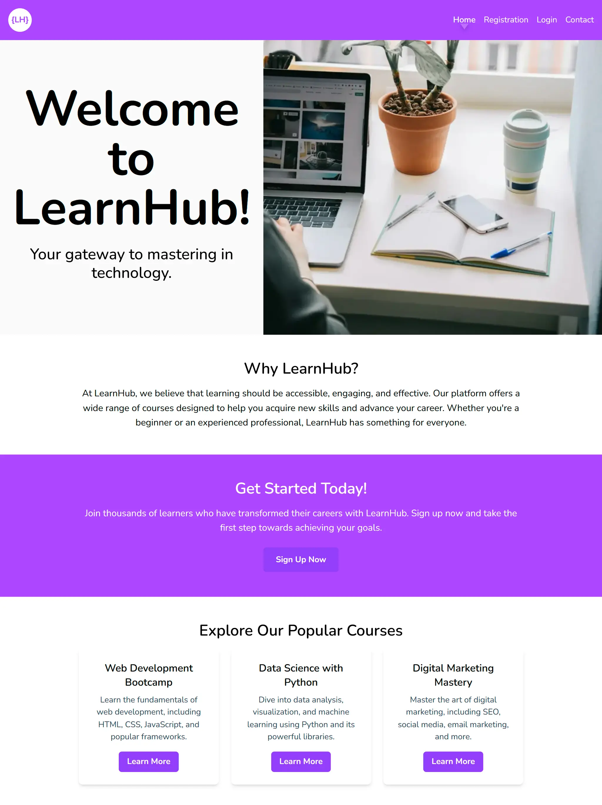
        <br/><strong>Home Page</strong>
      </td>
      <td align="center">
        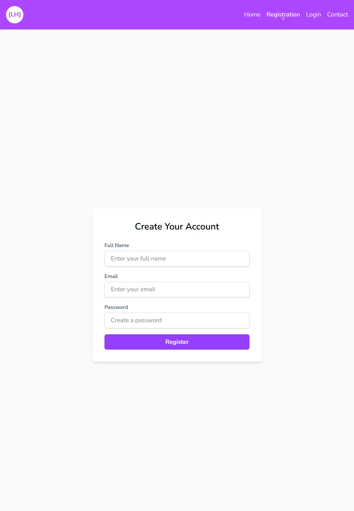
        <br/><strong>Registration</strong>
      </td>
    </tr>
    <tr>
      <td align="center">
        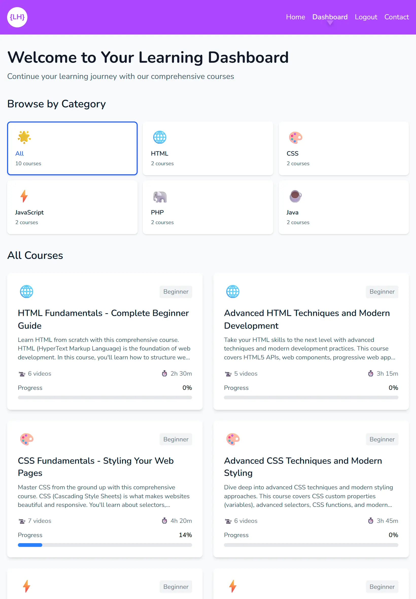
        <br/><strong>Dashboard</strong>
      </td>
      <td align="center">
        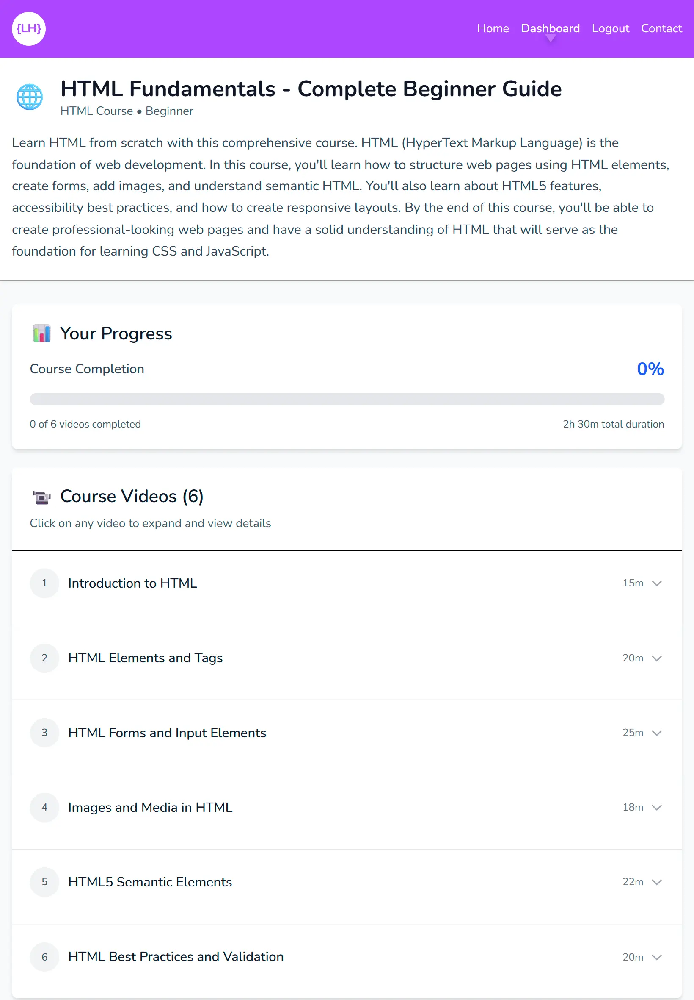
        <br/><strong>Course View</strong>
      </td>
    </tr>
    <tr>
      <td align="center">
        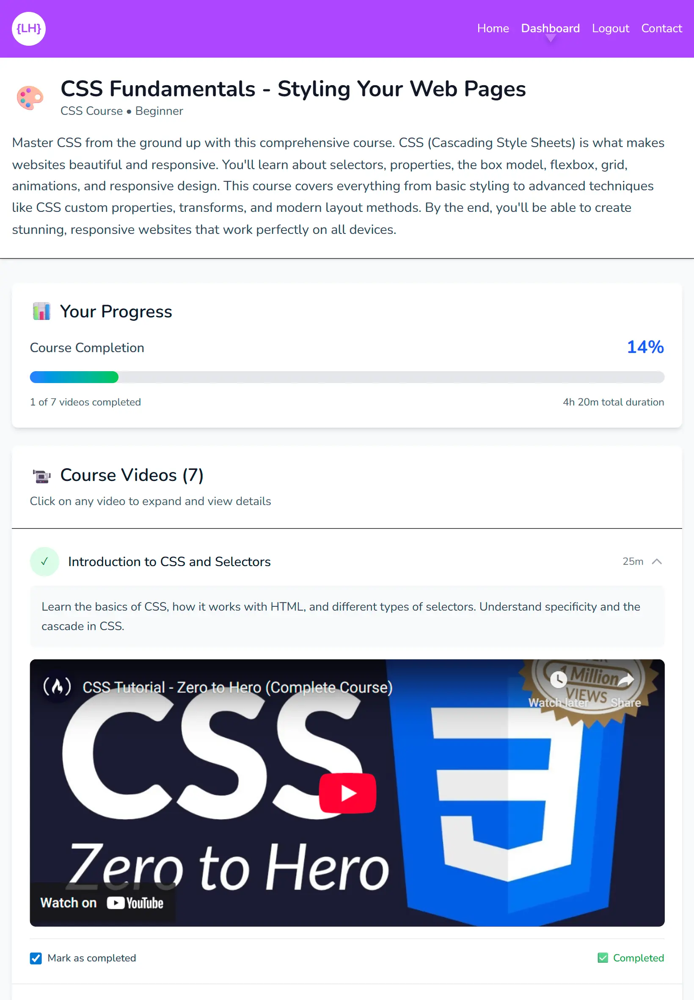
        <br/><strong>Course Details</strong>
      </td>
      <td align="center">
        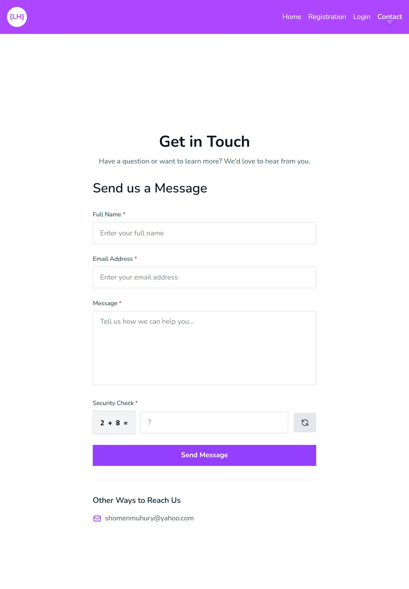
        <br/><strong>Contact</strong>
      </td>
    </tr>
  </table>
</div>

### Mobile View
<div align="center">
  <table>
    <tr>
      <td align="center">
        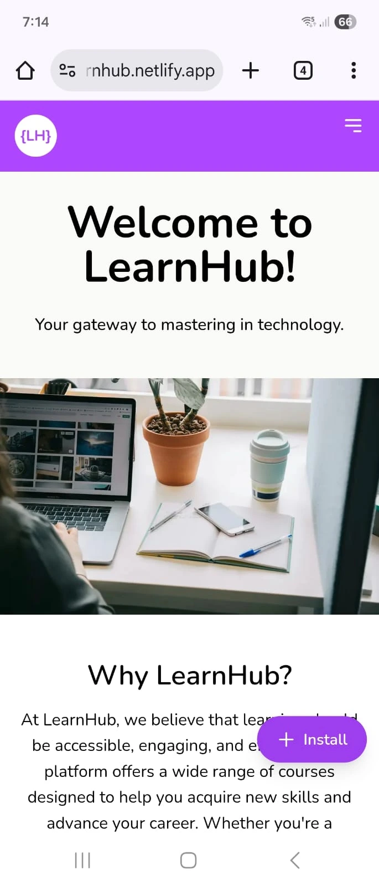
        <br/><strong>Home Page</strong>
      </td>
      <td align="center">
        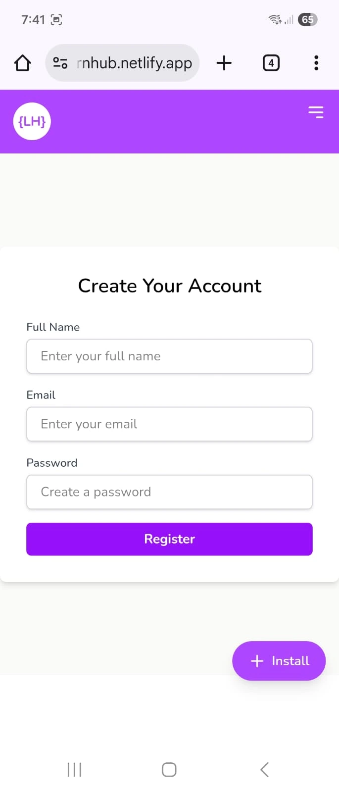
        <br/><strong>Registration</strong>
      </td>
    </tr>
    <tr>
      <td align="center">
        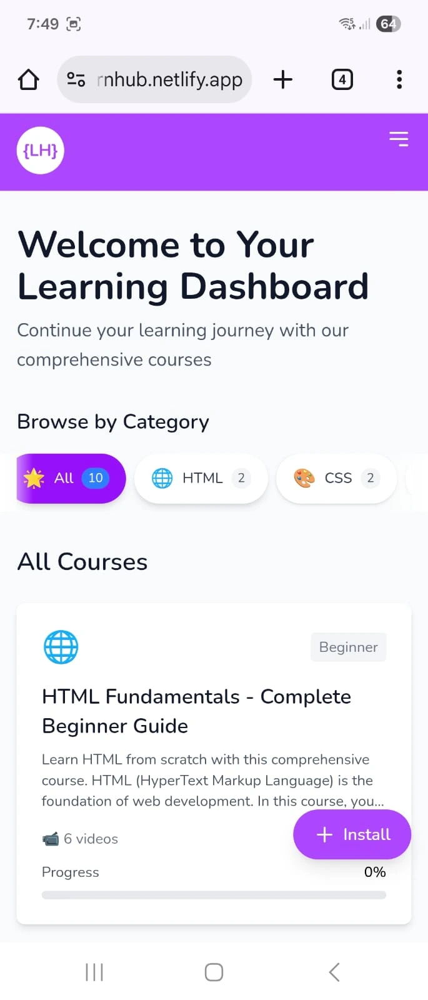
        <br/><strong>Dashboard</strong>
      </td>
      <td align="center">
        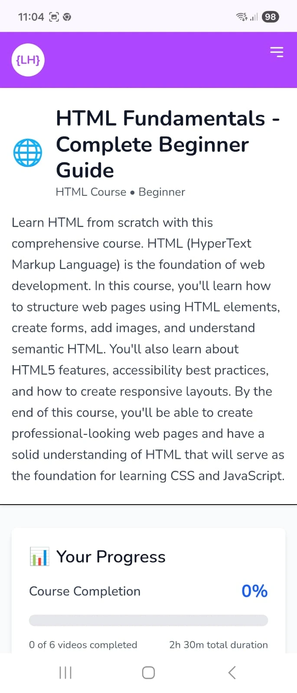
        <br/><strong>Course View</strong>
      </td>
    </tr>
    <tr>
      <td align="center">
        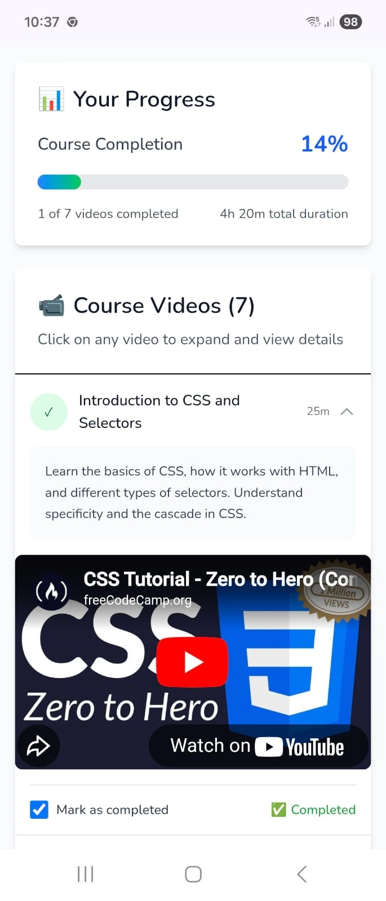
        <br/><strong>Course Details</strong>
      </td>
      <td align="center">
        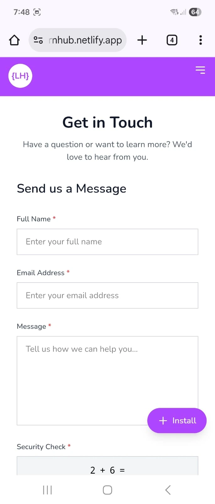
        <br/><strong>Contact</strong>
      </td>
    </tr>
  </table>
</div>

## ✨ Features

### Authentication & Security
- **User Registration & Login** with secure session management
- **JWT-based authentication** using HTTP-only cookies
- **Protected routes** with middleware-based authorization
- **Real-time email validation** with duplicate email checking
- **Form data preservation** on validation errors
- **Math captcha** for contact form spam protection
- **Honeypot field** for additional bot protection

### Course Management
- **Course browsing** with category-based filtering (HTML, CSS, JavaScript, PHP, Java)
- **Category icons** and visual indicators
- **Course details** with descriptions, duration, and video counts
- **Video player integration** with YouTube embed support
- **Progress tracking** with percentage completion
- **Video completion marking** with persistent state
- **Course completion badges** and visual feedback

### User Experience
- **Responsive design** optimized for mobile, tablet, and desktop
- **Mobile-friendly navigation** with hamburger menu
- **Loading skeletons** for improved perceived performance
- **Lazy loading** for images and components
- **Code splitting** with dynamic imports
- **Smooth animations** and transitions
- **Active route indicators** with visual feedback
- **Dark mode support** (via Tailwind CSS)

### Progressive Web App (PWA)
- **Installable app** with custom install button
- **Service worker** for offline functionality
- **App manifest** for native app experience
- **Cross-platform support** (iOS and Android)
- **Standalone mode** when installed

### Performance Optimizations
- **Server-side rendering (SSR)** for fast initial loads
- **Server Components** for optimal performance
- **Image optimization** with Next.js Image component
- **Lazy loading** for below-the-fold content
- **Dynamic imports** for code splitting
- **Suspense boundaries** with loading states
- **Route-based code splitting**

### Contact & Communication
- **Contact form** with validation
- **Email sending** via Resend API
- **Form validation** with Zod schema
- **Error handling** and user feedback

## 🛠️ Technologies Used

### Frontend
- **Next.js 16** - React framework with App Router
- **React 19** - UI library with latest features
- **TypeScript** - Type-safe development
- **Tailwind CSS 4** - Utility-first CSS framework
- **React Compiler** - Automatic React optimizations

### Backend & API
- **Next.js Server Actions** - Server-side form handling
- **Next.js Server Components** - Server-side rendering
- **Next.js Middleware** - Route protection and redirection
- **JOSE** - JWT token creation and verification
- **Zod** - Schema validation and type inference

### Data & Storage
- **JSON file-based storage** - User data and course progress
- **Cookie-based sessions** - Secure session management
- **File system operations** - Data persistence

### Email & Communication
- **Resend** - Transactional email service
- **Email validation** - Real-time duplicate checking

### PWA & Performance
- **next-pwa** - Progressive Web App support
- **Service Workers** - Offline functionality
- **Web App Manifest** - App installation support

### Development Tools
- **ESLint** - Code linting and quality
- **TypeScript** - Static type checking
- **PostCSS** - CSS processing
- **Autoprefixer** - CSS vendor prefixing

## 🚀 Getting Started

### Prerequisites
- Node.js 18+ and npm/yarn/pnpm
- Git

### Installation

1. **Clone the repository**
   ```bash
   git clone <repository-url>
   cd learn-pwa
   ```

2. **Install dependencies**
   ```bash
   npm install
   ```

3. **Set up environment variables**
   ```bash
   cp env.example .env.local
   ```
   
   Fill in your `.env.local` file:
   ```env
   JWT_SECRET=your-secret-key-here-minimum-32-characters-long
   RESEND_API_KEY=re_your_api_key_here
   RESEND_FROM_EMAIL=noreply@yourdomain.com
   ```

4. **Run the development server**
   ```bash
   npm run dev
   ```

5. **Open your browser**
   Navigate to [http://localhost:3001](http://localhost:3001)

### Building for Production

```bash
npm run build
npm start
```

## 📱 PWA Installation

The app can be installed on mobile devices and desktops:

- **Android/Chrome**: Click the install button that appears automatically
- **iOS/Safari**: Tap Share → Add to Home Screen
- **Desktop**: Use the install button in the address bar

## 🔒 Security Features

- Environment variables are never exposed to the client
- JWT tokens stored in HTTP-only cookies
- Server-side validation for all forms
- Protected API routes with middleware
- Secure session management
- Input sanitization and validation

## 📁 Project Structure

```
learn-pwa/
├── src/
│   ├── app/              # Next.js App Router pages
│   │   ├── dashboard/    # User dashboard and courses
│   │   ├── contact/      # Contact form page
│   │   ├── login/        # Login page
│   │   └── registration/ # Registration page
│   ├── components/       # React components
│   │   └── skeletons/    # Loading skeleton components
│   ├── lib/              # Utility functions and server actions
│   │   └── data/         # JSON data files
│   └── middleware.ts     # Route protection middleware
├── public/               # Static assets
└── next.config.ts        # Next.js configuration
```

## 🌐 Deployment

> **⚠️ Important Note on Serverless Platforms:**
> 
> This application uses file system-based data storage (JSON files) for user data and course progress. While this works perfectly on **localhost** and traditional hosting platforms with persistent file systems, it **will not work** on serverless platforms like Vercel, Netlify, or AWS Lambda.
> 
> **Why?** Serverless platforms use a **read-only, ephemeral file system** in production. This means:
> - Files can be read during build time, but cannot be written to at runtime
> - The file system is reset on each function invocation
> - Data written during one request will not persist to the next request
> 
> **For production deployment on serverless platforms**, you would need to migrate the data storage to:
> - A database (PostgreSQL, MongoDB, etc.)
> - A cloud storage service (AWS S3, Google Cloud Storage, etc.)
> - A database-as-a-service (Supabase, Firebase, PlanetScale, etc.)
> 
> The current implementation is ideal for:
> - Local development and testing
> - Traditional VPS/server hosting (DigitalOcean, AWS EC2, etc.)
> - Docker containers with persistent volumes
> - Self-hosted deployments


## 🎯 Key Highlights

- ✅ Full-stack application with server-side rendering
- ✅ Type-safe development with TypeScript
- ✅ Modern React patterns (Server Components, Server Actions)
- ✅ Progressive Web App with offline support
- ✅ Responsive design with mobile-first approach
- ✅ Performance optimizations (lazy loading, code splitting)
- ✅ Secure authentication and session management
- ✅ Real-time form validation
- ✅ Email integration for contact forms
- ✅ Production-ready code with error handling

## 📝 License

This project is licensed under the MIT License - see the [LICENSE](LICENSE) file for details.

---

Built with ❤️ using Next.js and modern web technologies.

